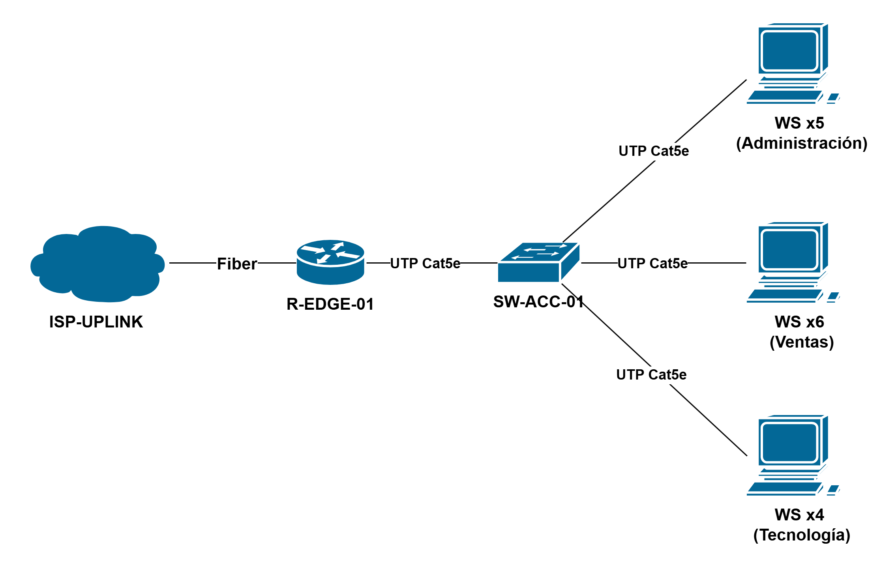
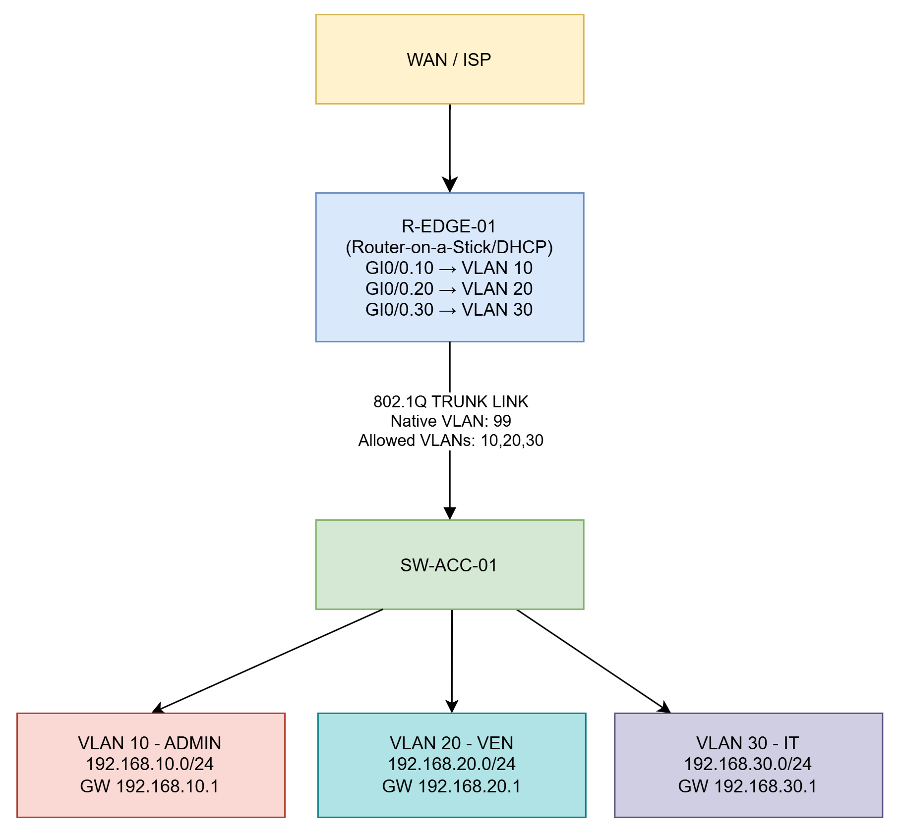

🏠 [Volver al inicio](../../README.md#-índice-de-documentación)

# Arquitectura de la red

La arquitectura de red propuesta define la organización de los dispositivos y servicios que conforman la infraestructura de la empresa. El diseño busca proporcionar una red segura, ordenada y escalable, mediante la segmentación de los departamentos, la administración eficiente del tráfico y la implementación de mecanismos de control de acceso.

## 1. Topología propuesta

La topología implementada corresponde a un modelo de red jerárquico simplificado, donde los equipos finales se conectan al switch de acceso y este mantiene un enlace troncal hacia el router perimetral.

El router cumple la función de interconectar las diferentes VLANs mediante la técnica Router-on-a-Stick, permitiendo la comunicación controlada entre departamentos y la salida hacia Internet. El enlace troncal entre el router y el switch permite transportar el tráfico correspondiente a todas las VLANs utilizando una única conexión física.

## 2. Infraestructura de red

La infraestructura física está compuesta por los siguientes elementos:

| Elemento | Cantidad | Función | 
|:--:|:--:|:--:| 
| Router Cisco 1941 | 1 | Realizar el enrutamiento entre VLANs, asignación DHCP, NAT/PAT y conexión hacia Internet. |
| Switch Cisco Catalyst 2960 | 1 | Conectar los equipos finales, administrar VLANs y transportar tráfico mediante enlaces troncales. | 
| Cableado UTP Cat5e | Según necesidad | Interconectar los dispositivos de la red local. |

## 3. Equipos finales

La infraestructura cuenta con un total de 15 estaciones de trabajo, distribuidas según las áreas funcionales de la empresa:

| Departamento | Segmento de red | Cantidad de equipos | 
|:--:|:--:|:--:|
| Administración | VLAN 10 - ADMIN | 5 | 
| Ventas | VLAN 20 - VEN | 6 |
| Tecnología | VLAN 30 - IT | 4 | 

## 4. Función de cada equipo

Los dispositivos que conforman la infraestructura de red cumplen funciones específicas dentro de la arquitectura propuesta. A continuación, se detallan las principales funciones asignadas a cada componente de la red.

| Dispositivo | Función |
|---|---|
| Router Cisco 1941 | • Proporciona la comunicación entre las VLAN mediante subinterfaces.  • Administra el servicio DHCP para la asignación automática de direcciones IP.  • Implementa políticas de seguridad mediante ACLs.  • Realiza la traducción de direcciones mediante NAT/PAT para permitir el acceso a Internet. |
| Switch Cisco Catalyst 2960 | • Conecta los equipos finales de la organización.  • Implementa la segmentación mediante VLANs.  • Administra el enlace troncal hacia el router.  • Permite una organización eficiente del tráfico interno.
| Estaciones de trabajo | • Permiten a los usuarios acceder a los recursos internos y servicios de Internet.  • Obtienen automáticamente la configuración IP mediante DHCP.  • Operan dentro del segmento correspondiente a su departamento. |

## 5. Criterios de escalabilidad

La arquitectura fue diseñada considerando el crecimiento futuro de la organización. Aunque la infraestructura actual está compuesta por un único switch y quince equipos, el diseño permite realizar ampliaciones sin modificar la lógica principal de funcionamiento.

Los criterios considerados incluyen:

* Incorporación de nuevos departamentos mediante la creación de nuevas VLANs.
* Ampliación de la cantidad de usuarios conectados a la red.
* Integración futura de servidores, impresoras de red u otros servicios corporativos.
* Posibilidad de agregar puntos de acceso inalámbricos para implementar una red WiFi empresarial.
* Facilidad de administración mediante una estructura organizada y segmentada.
 

## 6. Diagrama físico de red

### Explicación:

* **ISP-UPLINK:** Enlace WAN proporcionado por el proveedor de Internet (ISP), encargado de suministrar la conectividad externa hacia Internet y permitir la comunicación con la infraestructura interna de la organización.

* **Fibra óptica (Fiber):** Medio físico de transmisión utilizado para transportar el enlace WAN proporcionado por el ISP hasta el router perimetral (R-EDGE-01), ofreciendo alta capacidad, baja latencia y confiabilidad en la conexión.

* **UTP Cat5e:** Medio físico de transmisión basado en cobre utilizado para la comunicación Ethernet en la red LAN. Permite conectar las estaciones de trabajo y otros dispositivos finales al switch de acceso (SW-ACC-01), así como establecer el enlace de comunicación entre el switch de acceso (SW-ACC-01) y el router perimetral (R-EDGE-01).

* **R-EDGE-01:** Router perimetral encargado de interconectar la red LAN con el enlace del ISP. Gestiona el tráfico entre redes, enrutamiento, NAT y políticas de acceso según la configuración establecida.

* **SW-ACC-01:** Switch de acceso donde se conectan los dispositivos finales. Proporciona conectividad Ethernet, administración de VLAN y transporte de tráfico mediante enlaces de acceso o trunk. 

* **WS x4, WS x5, WS x6:** Conjunto de estaciones de trabajo (Workstations) conectadas al switch de acceso (SW-ACC-01) mediante cableado UTP Cat5e. La nomenclatura indica la cantidad de equipos representados en el diagrama físico.

## 7. Diagrama lógico de red

### Explicación:
 
* **WAN / ISP:** Representa la conexión hacia la red externa proporcionada por el proveedor de Internet. Permite la comunicación entre la infraestructura interna y servicios externos.

* **R-EDGE-01:** Dispositivo de borde encargado de gestionar la comunicación entre la red interna y la conectividad WAN hacia el ISP. Implementa la tecnología *Router-on-a-Stick* mediante una única interfaz física con subinterfaces lógicas asociadas a las VLAN configuradas, permitiendo el *enrutamiento inter-VLAN* y funcionando como puerta de enlace predeterminada para cada segmento de red. Además, administra el *servicio DHCP* para la asignación automática de direcciones IP a los clientes y proporciona la salida hacia Internet. Las subinterfaces configuradas son *GI0/0.10* para la VLAN 10, *GI0/0.20* para la VLAN 20 y *GI0/0.30* para la VLAN 30, donde cada una actúa como gateway de su respectiva red lógica.

* **802.1Q Trunk Link:** Enlace troncal entre el router perimetral *(R-EDGE-01)* y el switch de acceso *(SW-ACC-01)*. Transporta tráfico de múltiples VLAN mediante *etiquetado IEEE 802.1Q* sobre un único enlace físico.

* **Native VLAN:** Es la VLAN nativa del enlace trunk 802.1Q. Las tramas que pertenecen a esta VLAN se transmiten sin etiqueta (untagged) por el enlace trunk, y cualquier trama sin etiqueta que llegue al trunk se asocia a la *VLAN 99*.

* **Allowed VLANs:** Lista de VLANs que tienen permiso para transportar tráfico por un *enlace trunk 802.1Q*.

* **SW-ACC-01:** Switch de capa 2 encargado de la conexión de los dispositivos finales. Administra la asignación de puertos a VLAN y permite el transporte del tráfico hacia el router perimetral *(R-EDGE-01)* mediante un enlace troncal.

* **VLAN 10 - ADMIN:** VLAN correspondiente al segmento destinado al departamento de Administración. Su identificación incluye el número de VLAN *(10)*, el nombre asignado *(ADMIN)*, el segmento IP utilizado *(192.168.10.0/24)* y la puerta de enlace correspondiente *(GW: 192.168.10.1)*.

* **VLAN 20 - VEN:** VLAN correspondiente al segmento destinado al departamento de Ventas. Su identificación incluye el número de VLAN *(20)*, el nombre asignado *(VEN)*, el segmento IP utilizado *(192.168.20.0/24)* y la puerta de enlace correspondiente *(GW: 192.168.20.1)*.

* **VLAN 30 - IT:** VLAN correspondiente al segmento destinado al departamento de Tecnología. Su identificación incluye el número de VLAN *(30)*, el nombre asignado *(IT)*, el segmento IP utilizado *(192.168.30.0/24)* y la puerta de enlace correspondiente *(GW: 192.168.30.1)*.
 

 
  

⬅️ Anterior: [***Requerimientos funcionales***](../requerimientos/requerimientos.md)

➡️ Siguiente: [***Diseño de VLAN***](./02-VLAN.md)