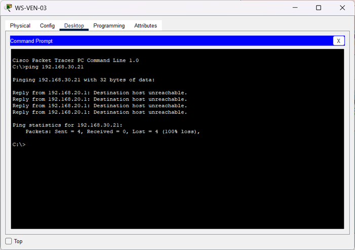

🏠 [Volver al inicio](../../README.md#-índice-de-documentación)

# Restricción de acceso desde Ventas

**Objetivo:** Validar el funcionamiento de las reglas de seguridad implementadas mediante listas de control de acceso (ACL).

**Pruebas realizadas:**  
- Desde equipos pertenecientes a la VLAN 20 (Ventas) se ejecutaron pruebas `ping` hacia equipos pertenecientes a la VLAN 10 (Administración).  
- Desde equipos pertenecientes a la VLAN 20 (Ventas) se ejecutaron pruebas `ping` hacia equipos pertenecientes a la VLAN 30 (Tecnología).  
- Se comprobó si el tráfico entre ambos segmentos era permitido o rechazado según la política configurada.

**Resultado:** La comunicación fue denegada correctamente por la ACL aplicada en el router, evitando el acceso no autorizado entre VLANs.
 

---------


## Prueba 1 (WS-VEN-03 a WS-ADMIN-01):

**Comando:**  
  
```bash  
C:\>ping 192.168.30.21
```  
**Salida:**

```text   
Pinging 192.168.30.21 with 32 bytes of data:

Reply from 192.168.20.1: Destination host unreachable.
Reply from 192.168.20.1: Destination host unreachable.
Reply from 192.168.20.1: Destination host unreachable.
Reply from 192.168.20.1: Destination host unreachable.

Ping statistics for 192.168.30.21:
    Packets: Sent = 4, Received = 0, Lost = 4 (100% loss),
```

**Evidencia:**  


 

---------


## Prueba 2 (WS-VEN-04 a WS-IT-01): 

**Comando:**  
  
```bash  
C:\>ping 192.168.30.21
```  
**Salida:**

```text    
Pinging 192.168.30.21 with 32 bytes of data:

Reply from 192.168.20.1: Destination host unreachable.
Reply from 192.168.20.1: Destination host unreachable.
Reply from 192.168.20.1: Destination host unreachable.
Reply from 192.168.20.1: Destination host unreachable.

Ping statistics for 192.168.30.21:
    Packets: Sent = 4, Received = 0, Lost = 4 (100% loss),
```

**Evidencia:**  
 

  


<br>
<br> 

⬅️ Anterior: [***Segmentación y aislamiento entre VLAN***](./PV-02-segmentacion-vlan.md)

➡️ Siguiente: [***Restricción de acceso desde Administración***](./PV-04-restriccion-vlan-admin.md)