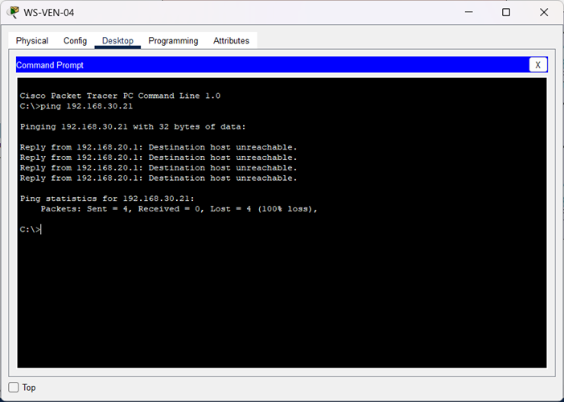
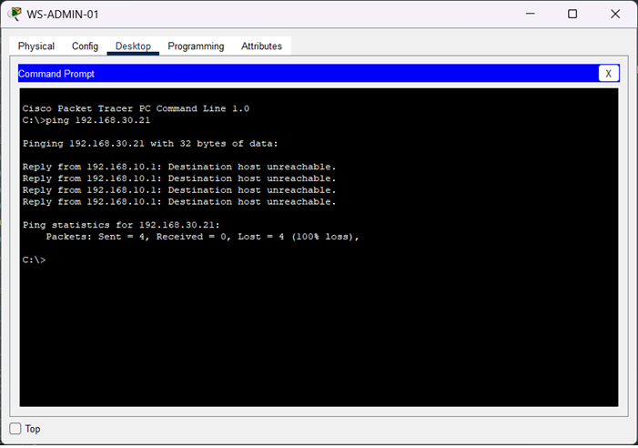

🏠 [Volver al inicio](../../README.md#-índice-de-documentación)

# Restricción de acceso desde Administración

**Objetivo:** Validar el funcionamiento de las reglas de seguridad implementadas mediante listas de control de acceso (ACL).

**Pruebas realizadas:**  
- Desde equipos pertenecientes a la VLAN 10 (Administración) se ejecutaron pruebas `ping` hacia equipos pertenecientes a la VLAN 20 (Ventas).  
- Desde equipos pertenecientes a la VLAN 10 (Administración) se ejecutaron pruebas `ping` hacia equipos pertenecientes a la VLAN 30 (Tecnología).  
- Se comprobó si el tráfico entre ambos segmentos era permitido o rechazado según la política configurada.

**Resultado:** La comunicación fue denegada correctamente por la ACL aplicada en el router, evitando el acceso no autorizado entre VLANs.
 

---------


## Prueba 1 (WS-ADMIN-04 a WS-VEN-03): 

**Comando:**  
  
```bash  
C:\>ping 192.168.30.23
```  
**Salida:**

```text   
Pinging 192.168.30.23 with 32 bytes of data:

Reply from 192.168.10.1: Destination host unreachable.
Reply from 192.168.10.1: Destination host unreachable.
Reply from 192.168.10.1: Destination host unreachable.
Reply from 192.168.10.1: Destination host unreachable.

Ping statistics for 192.168.30.23:
    Packets: Sent = 4, Received = 0, Lost = 4 (100% loss),
```

**Evidencia:**  
 

 

---------


## Prueba 2 (WS-ADMIN-01 a WS-IT-01):

**Comando:**  
  
```bash  
C:\>ping 192.168.30.21
```  
**Salida:**
```text   
Pinging 192.168.30.21 with 32 bytes of data:

Reply from 192.168.10.1: Destination host unreachable.
Reply from 192.168.10.1: Destination host unreachable.
Reply from 192.168.10.1: Destination host unreachable.
Reply from 192.168.10.1: Destination host unreachable.

Ping statistics for 192.168.30.21:
    Packets: Sent = 4, Received = 0, Lost = 4 (100% loss),
```

**Evidencia:**  




<br>
<br> 

⬅️ Anterior: [***Restricción de acceso desde Ventas***](./PV-03-restriccion-vlan-ventas.md)

➡️ Siguiente: [***Acceso del departamento de IT a los segmentos internos***](./PV-05-acceso-it.md)