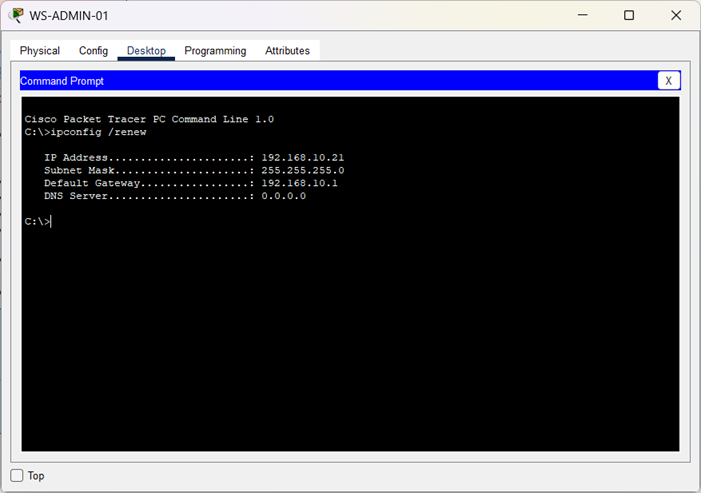
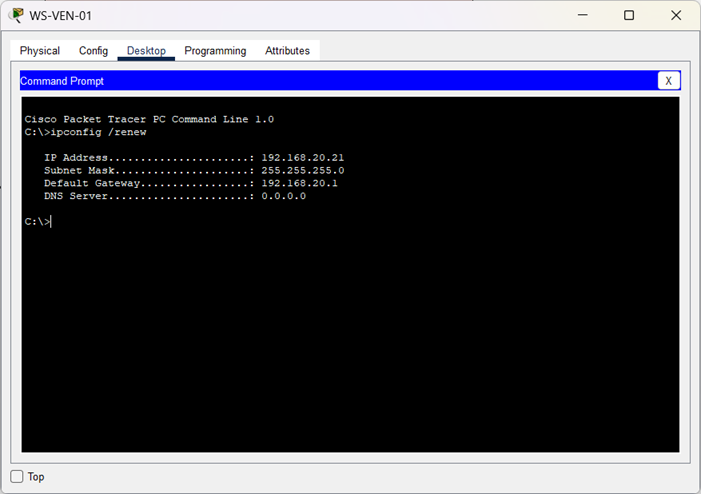
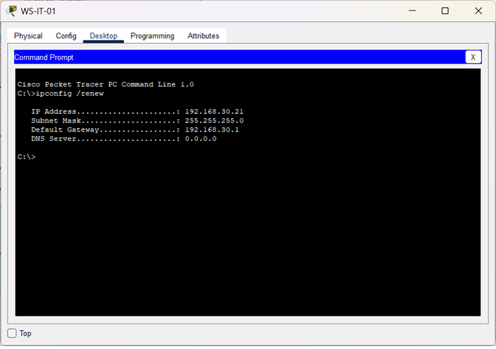

🏠 [Volver al inicio](../../README.md#-índice-de-documentación)

# Asignación automática de direcciones IP (DHCP)

**Objetivo:** Verificar que los equipos reciban una dirección IP automáticamente.

**Prueba realizada:**  
- En cada estación de trabajo se ejecutó el comando `ipconfig /renew` para solicitar una nueva configuración IP al servidor DHCP.  
- Se verificó la asignación de dirección IPv4, máscara de subred y puerta de enlace correspondiente a cada VLAN.

**Resultado:** Los equipos recibieron correctamente los parámetros de red asignados mediante DHCP.

| Equipo | VLAN | Dirección IPv4 | Máscara de subred | Puerta de enlace |
|--|--|--|--|--|
| WS-ADMIN-01 | VLAN 10 | 192.168.10.21 | 255.255.255.0 | 192.168.10.1 |
| WS-VENTAS-01 | VLAN 20 | 192.168.20.21 | 255.255.255.0 | 192.168.20.1 |
| WS-IT-01 | VLAN 30 | 192.168.30.21 | 255.255.255.0 | 192.168.30.1 |
  

**Evidencia (WS-ADMIN-01):**  

----------

**Evidencia (WS-VEN-01):**  

----------

**Evidencia (WS-IT-01):**  
 

  
 
  

⬅️ Anterior: [***Pruebas de funcionamiento***](./README.md)

➡️ Siguiente: [***Segmentación y aislamiento entre VLAN***](./PV-02-segmentacion-vlan.md)