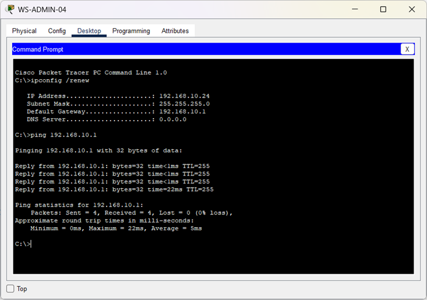
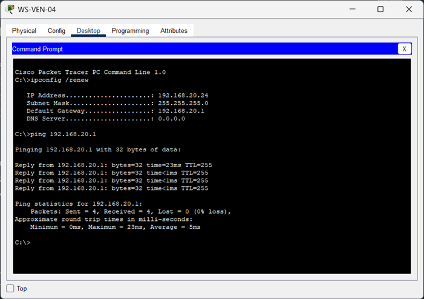
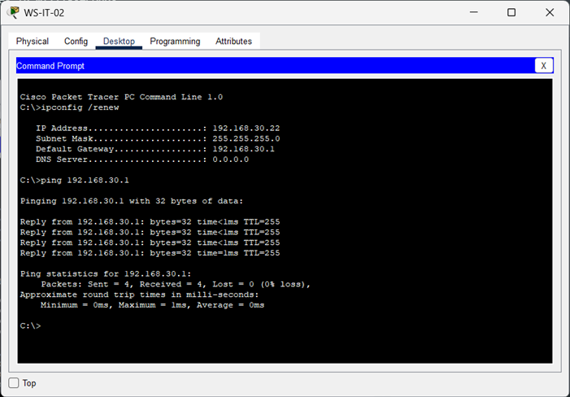

🏠 [Volver al inicio](../../README.md#-índice-de-documentación)

# Segmentación y aislamiento entre VLAN

**Objetivo:** Validar que los puestos de trabajo puedan alcanzar su puerta de enlace configurada, comprobando la comunicación entre los equipos finales y las interfaces de capa 3 del router.

**Prueba realizada:**
- Desde los equipos finales se ejecutó un `ping` hacia la dirección IP del gateway correspondiente a su VLAN.

**Resultado:** La comunicación fue exitosa, confirmando que existe conectividad entre los equipos de la LAN y el router encargado del enrutamiento inter-VLAN.


---------


## Prueba 1 (WS-ADMIN-04): 

**Comando:**  
  
```bash  
C:\>ping 192.168.10.1
```  
**Salida:**
```text   
Pinging 192.168.10.1 with 32 bytes of data:

Reply from 192.168.10.1: bytes=32 time<1ms TTL=255
Reply from 192.168.10.1: bytes=32 time<1ms TTL=255
Reply from 192.168.10.1: bytes=32 time<1ms TTL=255
Reply from 192.168.10.1: bytes=32 time=22ms TTL=255

Ping statistics for 192.168.10.1:
		Packets: Sent = 4, Received = 4, Lost = 0 (0% loss),
Approximate round trip times in milli-seconds:
		Minimum = 0ms, Maximum = 22ms, Average = 5ms
```

**Evidencia:**  




---------


## Prueba 2 (WS-VENT-04):

**Comando:**  
  
```bash  
C:\>ping 192.168.20.1
```  
**Salida:**
```text   
Pinging 192.168.20.1 with 32 bytes of data:

Reply from 192.168.20.1: bytes=32 time=23ms TTL=255
Reply from 192.168.20.1: bytes=32 time<1ms TTL=255
Reply from 192.168.20.1: bytes=32 time<1ms TTL=255
Reply from 192.168.20.1: bytes=32 time<1ms TTL=255

Ping statistics for 192.168.20.1:
    Packets: Sent = 4, Received = 4, Lost = 0 (0% loss),
Approximate round trip times in milli-seconds:
    Minimum = 0ms, Maximum = 23ms, Average = 5ms
```

**Evidencia:**  




---------


## Prueba 3 (WS-IT-02):

**Comando:**  
  
```bash  
C:\>ping 192.168.30.1
```  
**Salida:**
```text   
Pinging 192.168.30.1 with 32 bytes of data:

Reply from 192.168.30.1: bytes=32 time<1ms TTL=255
Reply from 192.168.30.1: bytes=32 time<1ms TTL=255
Reply from 192.168.30.1: bytes=32 time<1ms TTL=255
Reply from 192.168.30.1: bytes=32 time=1ms TTL=255

Ping statistics for 192.168.30.1:
    Packets: Sent = 4, Received = 4, Lost = 0 (0% loss),
Approximate round trip times in milli-seconds:
    Minimum = 0ms, Maximum = 1ms, Average = 0ms
```

**Evidencia:**  




<br>
<br> 

⬅️ Anterior: [***Asignación automática de direcciones IP (DHCP)***](./PV-01-asignacion-DHCP.md)

➡️ Siguiente: [***Restricción de acceso desde Ventas***](./PV-03-restriccion-vlan-ventas.md)