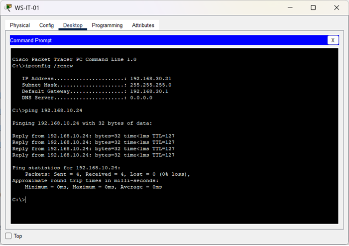

🏠 [Volver al inicio](../../README.md#-índice-de-documentación)

# Acceso del departamento de IT a los segmentos internos

**Objetivo:** Verificar que la VLAN correspondiente al área de IT tenga permisos de comunicación hacia los diferentes segmentos internos.  
  
**Prueba realizada:**  
- Desde equipos pertenecientes a la VLAN 30 (IT) se realizaron pruebas `ping` hacia dispositivos ubicados en VLAN 10 (Administración) y VLAN 20 (Ventas).  
- Se verificó la conectividad entre redes mediante el enrutamiento inter-VLAN.  
  
**Resultado:** Se confirmó la comunicación desde la VLAN IT hacia las demás VLAN internas, validando la política de acceso establecida.


---------
 

## Prueba 1 (WS-IT-01 a WS-ADMIN-04):

**Comando:**  
  
```bash  
C:\>ping 192.168.10.24
```  
**Salida:**
```text   
Pinging 192.168.10.24 with 32 bytes of data:
 
Reply from 192.168.10.24: bytes=32 time<1ms TTL=127
Reply from 192.168.10.24: bytes=32 time<1ms TTL=127
Reply from 192.168.10.24: bytes=32 time<1ms TTL=127
Reply from 192.168.10.24: bytes=32 time<1ms TTL=127
  
Ping statistics for 192.168.10.24:
		Packets: Sent = 4, Received = 4, Lost = 0 (0% loss),
Approximate round trip times in milli-seconds:
		Minimum = 0ms, Maximum = 0ms, Average = 0ms
```

**Evidencia:**  




---------
 

## Prueba 2 (WS-IT-04 a WS-VENTAS-04): 

**Comando:**  
  
```bash  
C:\>ping 192.168.20.24
```  
**Salida:**

```text    
Pinging 192.168.20.24 with 32 bytes of data:
  
Reply from 192.168.20.24: bytes=32 time<1ms TTL=127
Reply from 192.168.20.24: bytes=32 time=21ms TTL=127
Reply from 192.168.20.24: bytes=32 time<1ms TTL=127
Reply from 192.168.20.24: bytes=32 time<1ms TTL=127

Ping statistics for 192.168.20.24:
		Packets: Sent = 4, Received = 4, Lost = 0 (0% loss),
Approximate round trip times in milli-seconds:
		Minimum = 0ms, Maximum = 21ms, Average = 5ms
```

**Evidencia:**  
 


<br>
<br> 


⬅️ Anterior: [***Restricción de acceso desde Administración***](./PV-04-restriccion-vlan-admin.md)